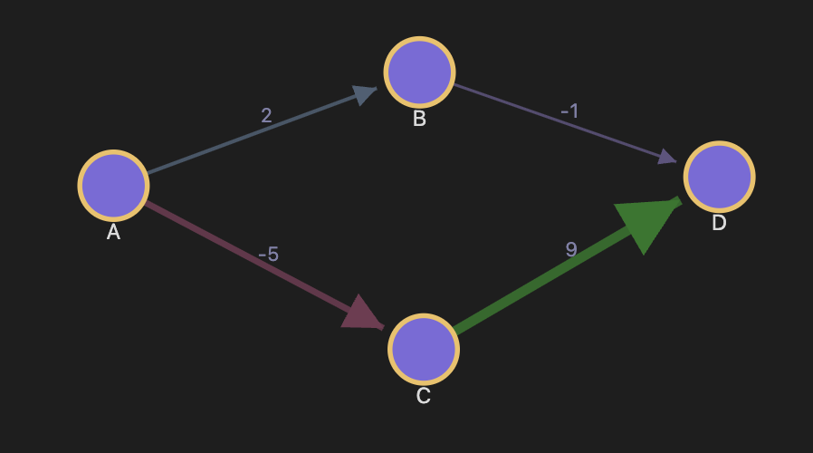

# Obsidian Weighted Graph

An [Obsidian](https://obsidian.md) plugin that renders a **directed, weighted graph** of your notes — built for the cases where a plain link isn't enough and you want to express *how strongly* one note connects to another.



## How it works

Add weighted edges to any note using this syntax anywhere in the file:

```
[[Target Note]]::5
[[Another Note]]::-2
[[Weak Connection]]::1
```

The number after `::` is the **weight**. Positive weights render green, negative weights render red, with a full spectrum in between. Edge thickness scales with the absolute value of the weight.

You can place these anywhere in your note — top, bottom, inline with text. No frontmatter block required.

## Features

- **Directed edges** with arrowheads showing the direction of the connection
- **Weight-based color** — dark red (−10) → neutral purple (0) → dark green (+10)
- **Weight-based thickness** — stronger connections are visually thicker
- **Interactive layout** — drag nodes freely; they stay pinned where you place them (gold border). Click a pinned node to release it
- **Double-click** any node to open that note in Obsidian
- **Live updates** — the graph rebuilds automatically as you edit your notes
- **Filtering**
  - *Connected only* (default on) — hides isolated notes with no weighted edges
  - *Filter by mention* — show only notes whose content contains `[[Note Name]]`, useful for scoping the graph to a topic. Multiple filters can be active at once

## Installation

### From the community plugin list *(coming soon)*

Search for **Weighted Graph** in Settings → Community Plugins → Browse.

### Manual installation

1. Download `main.js`, `manifest.json`, and `styles.css` from the [latest release](https://github.com/jamesms36/obsidian-weighted-graph/releases/latest)
2. Copy them into `<your vault>/.obsidian/plugins/obsidian-weighted-graph/`
3. In Obsidian: Settings → Community Plugins → enable **Weighted Graph**

## Usage

Click the **share icon** in the left ribbon, or run the command **Open weighted graph** from the command palette.

### Syntax reference

| Syntax | Meaning |
|--------|---------|
| `[[Note]]::5` | Edge to "Note" with weight 5 (green) |
| `[[Note]]::-3` | Edge to "Note" with weight −3 (red) |
| `[[Note]]::0` | Edge to "Note" with neutral weight |

Weights work best on a scale of roughly −10 to +10, but any number is valid.

### Filters

The filter bar at the top of the graph view has two controls:

- **Connected only** — when checked (the default), hides notes that have no weighted edges at all. Uncheck to show your entire vault.
- **Filter by mention** — type a note name and press Enter or click Add. The graph narrows to only notes whose files contain `[[that note name]]`. Add multiple filters to show notes that mention any of them. Click **×** on a pill to remove it.

## Building from source

Requires Node.js.

```bash
git clone https://github.com/jamesms36/obsidian-weighted-graph
cd obsidian-weighted-graph
npm install
npm run build
```

Copy `main.js`, `manifest.json`, and `styles.css` into your vault's plugin folder as described above.

## License

MIT
